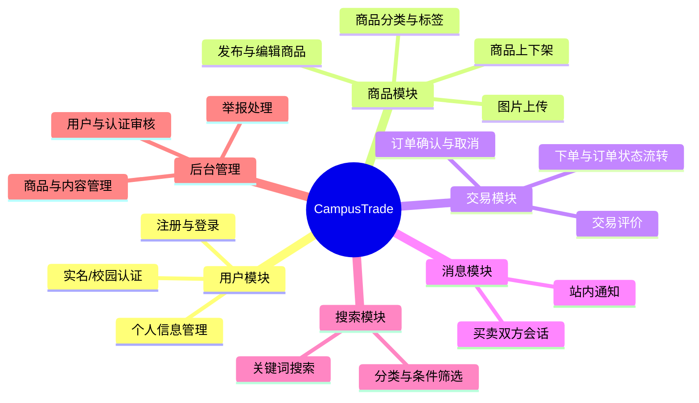
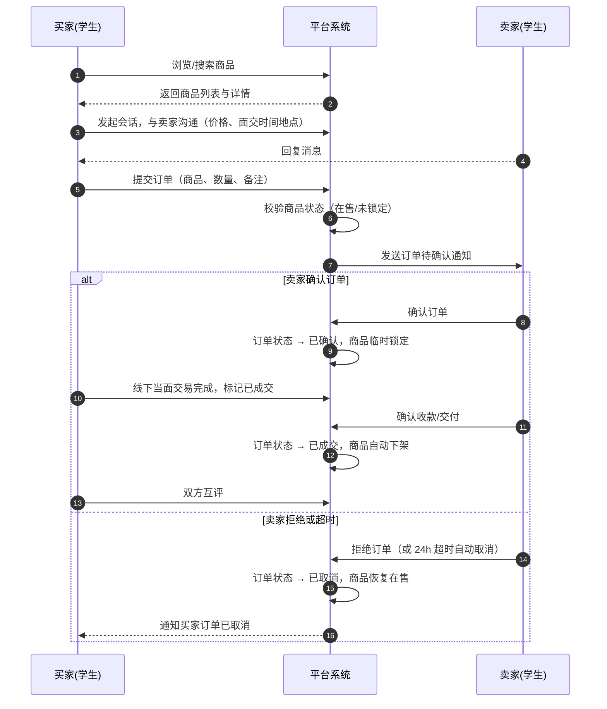

# CampusTrade 校园二手交易平台

> **课程**：微服务开发与实践
> **姓名**：林昆泽
> **学号**：2401110736
> **仓库用途**：本课程唯一项目仓库，用于记录从需求分析、单体开发到微服务拆分、测试、部署与文档整理的全过程，每周作业见 [`docs/homework/`](docs/homework/)。

## 快速开始（当前进度：Week 03 工程起步）

**环境要求**：JDK 25（`java --version` 验证），Maven 无需预装（工程自带 Maven Wrapper，自动下载 Maven 3.9.16）。

```bash
cd monolith
./mvnw test               # 运行启动测试（@SpringBootTest，验证应用上下文可加载）
./mvnw spring-boot:run    # 启动应用，默认端口 8080
```

| 验证项 | 地址 | 预期结果 |
| --- | --- | --- |
| 问候接口 | `http://localhost:8080/api/hello` | JSON，含项目名称与问候消息 |
| 健康检查 | `http://localhost:8080/actuator/health` | `{"status":"UP"}` |

**当前尚未实现的业务能力**：用户注册登录、商品发布与管理、订单流程、消息沟通、搜索等所有业务功能——本周仅完成可运行的工程骨架与运行状态验证，业务模型（Item、Order）的规划见 [docs/project-proposal.md](docs/project-proposal.md)，将从下一周开始逐步实现。

## 目录

- [项目简介](#项目简介)
- [业务背景](#业务背景)
- [目标用户与角色](#目标用户与角色)
- [项目目标与适用场景](#项目目标与适用场景)
- [功能模块划分](#功能模块划分)
- [核心业务流程](#核心业务流程)
- [当前范围与暂不实现的内容](#当前范围与暂不实现的内容)
- [后续演进方向](#后续演进方向)
- [仓库结构](#仓库结构)
- [文档导航](#文档导航)

## 项目简介

CampusTrade 是一个面向高校校园的二手闲置物品交易平台。学生可以在平台上发布自己不再使用的教材、数码产品、生活用品等闲置物品，其他学生可以浏览、搜索、下单购买，并通过平台内置的消息功能与卖家沟通，完成线下或线上的交易闭环。

本项目是本学期《微服务开发与实践》课程的唯一课程项目，将按照课程节奏从单体应用起步，逐步演进为基于 Spring Cloud 的微服务架构。

## 业务背景

每年毕业季和开学季，高校学生都会产生大量的闲置物品：教材教辅、台灯、自行车、数码配件、收纳用品等。这些物品往往还有很高的使用价值，但缺乏高效的流转渠道，最后大多被低价卖给回收站或直接丢弃，造成浪费。同时，新生和在校生又常常需要以较低的价格购置这些物品。

现有的通用二手交易平台（如闲鱼）面向全社会，存在交易对象不确定、信任成本高、线下交付不便（跨城邮寄）等问题，校园内的面对面交付反而被弱化。一个**限定校园范围、以面交为主**的二手交易平台，能够显著降低信任成本和交易成本，具有明确的实际价值。

## 目标用户与角色

| 角色 | 描述 | 核心需求 |
| --- | --- | --- |
| **游客** | 未登录的访客 | 浏览商品列表与详情，了解平台内容，注册成为用户 |
| **学生（买家）** | 已认证的在校学生 | 按分类/关键词搜索商品，查看商品详情与卖家信息，下单购买，与卖家沟通，查看订单状态，对交易进行评价 |
| **学生（卖家）** | 已认证的在校学生 | 发布/编辑/下架闲置商品，管理自己发布的商品，处理订单（确认/拒绝），与买家沟通，查看交易收入 |
| **管理员** | 平台运营人员（教师/助教模拟） | 用户认证审核，违规商品与信息管理，类目维护，处理举报，平台数据概览 |

> 买家和卖家是同一类用户的两种状态，一个学生账号既可以买东西也可以卖东西，这是二手平台的典型特征。

## 项目目标与适用场景

**项目目标**

- 为校园内的二手闲置物品提供一个发布、发现、交易的闭环平台；
- 以本平台为载体，完成课程要求的微服务完整生命周期实践：需求分析 → 单体实现 → 服务拆分 → 服务治理 → 容器化部署。

**适用场景**

- 毕业季：毕业生批量处理带不走的物品；
- 开学季：新生低价购置教材和生活用品；
- 日常：学生随时处置闲置、淘换物品；
- 交易以**校内面对面交付**为主，平台不处理真实支付（详见「当前范围」）。

## 功能模块划分



| 模块 | 具体功能 | 优先级 |
| --- | --- | --- |
| 用户模块 | 注册、登录、个人资料管理、校园邮箱认证 | P0 |
| 商品模块 | 发布商品（标题、描述、价格、分类、图片）、编辑、上架/下架、删除 | P0 |
| 交易模块 | 创建订单、订单状态机（待确认 → 已确认 → 已成交/已取消）、双方互评 | P0 |
| 消息模块 | 买卖双方的站内会话、订单相关系统通知 | P1 |
| 搜索模块 | 关键词搜索、按分类/价格/发布时间筛选 | P1 |
| 后台管理 | 用户认证审核、违规商品下架、举报处理、基础数据统计 | P1 |

## 核心业务流程

以「买家下单到交易完成」为例的完整流程：



关键规则说明：

- **不接入真实支付**：校园场景以当面交付为主，交易确认由双方线下完成后在平台上标记，避免支付合规与资金安全问题。
- **商品锁定**：订单被卖家确认后商品进入锁定状态，防止一单多卖；订单取消或成交后自动解锁/下架。
- **状态机驱动**：订单状态变化只允许沿预设路径流转，保证流程可追踪、可测试。

## 当前范围与暂不实现的内容

**本期（学期内）范围**

- Web 端（浏览器访问）的学生端功能：注册登录、商品发布与管理、搜索、下单、消息、评价；
- 简单的管理员后台：认证审核、违规处理；
- 单机/容器化部署，支撑课程演示与验收。

**暂不实现**

- 真实在线支付与资金托管（使用「线下交付 + 平台标记」替代）；
- 移动端 App / 小程序；
- 物流与快递相关功能；
- 基于大数据的个性化推荐与比价；
- 多学校/多校区加盟运营。

暂不实现的原因：课程重点考察微服务的**设计、拆分与部署能力**，而非业务功能的堆叠；以上功能对本学期目标不是必需的，且会显著扩大边界。

## 后续演进方向

按照课程技术栈（Spring Cloud + Docker），平台将按以下方向逐步演进：

| 方向 | 计划 |
| --- | --- |
| **认证** | 引入 Spring Security + JWT 实现无状态登录；管理员与学生角色权限分离 |
| **服务拆分** | 单体按业务边界拆分为：API 网关（Spring Cloud Gateway）、用户服务、商品服务、订单服务、消息服务，各服务独立数据库 |
| **服务治理** | Nacos 实现服务发现与配置中心；OpenFeign 声明式服务调用；LoadBalancer 负载均衡；Resilience4j 断路器与容错 |
| **消息** | 引入消息队列（RabbitMQ），实现订单事件异步通知（如订单状态变更通知消息服务），服务间解耦 |
| **分布式事务** | 对「下单锁库存 + 创建订单」等多服务写操作，用 Seata 或最终一致性方案保证数据一致 |
| **可观测性** | Micrometer Tracing + Zipkin 分布式链路追踪；日志聚合；关键指标监控告警 |
| **部署** | 先用 Docker Compose 编排全栈服务，条件允许时迁移到 Kubernetes，实现滚动更新与弹性伸缩 |

## 仓库结构

```text
.
├── README.md                  # 项目总览（本文件）
├── monolith/                  # 单体工程（Week 03 起步，逐步演进到微服务）
│   ├── pom.xml                # Maven 工程（Spring Boot 4.0.x / Java 25）
│   ├── mvnw                   # Maven Wrapper
│   └── src/                   # 启动类、配置、接口与测试
├── docs/
│   ├── project-proposal.md    # 项目选题说明（业务场景与核心模型规划）
│   └── homework/              # 每周作业记录
│       ├── week-01/           # 开发环境与个人仓库
│       ├── week-02/           # 项目选题与功能规划
│       └── week-03/           # Spring Boot 工程起步
└── src/                       # （预留，后续按课程要求调整使用）
```

## 文档导航

- [Week 01：开发环境与个人仓库](docs/homework/week-01/index.md)
- [Week 02：项目选题与功能规划](docs/homework/week-02/index.md)
- [Week 03：Spring Boot 工程起步](docs/homework/week-03/index.md)
